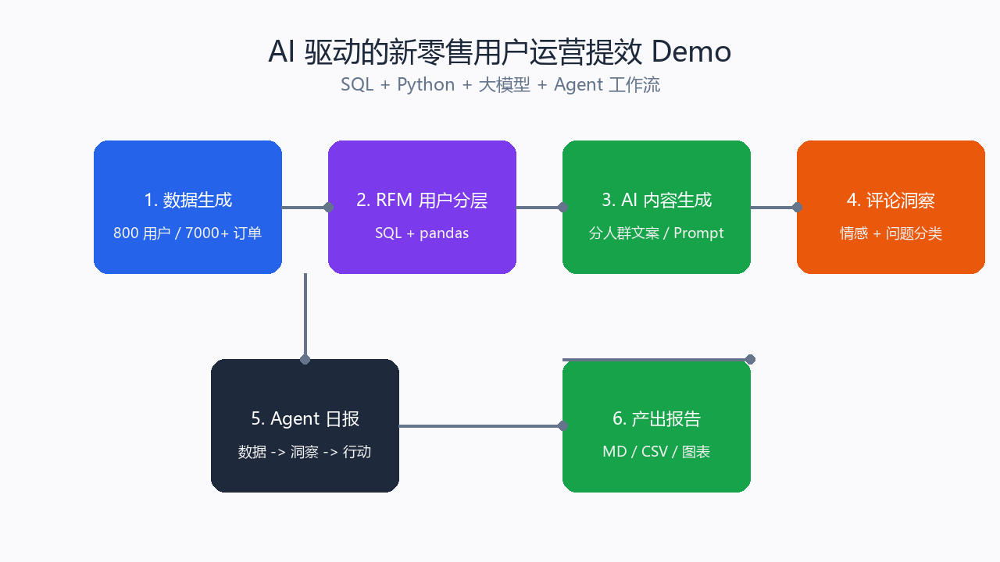
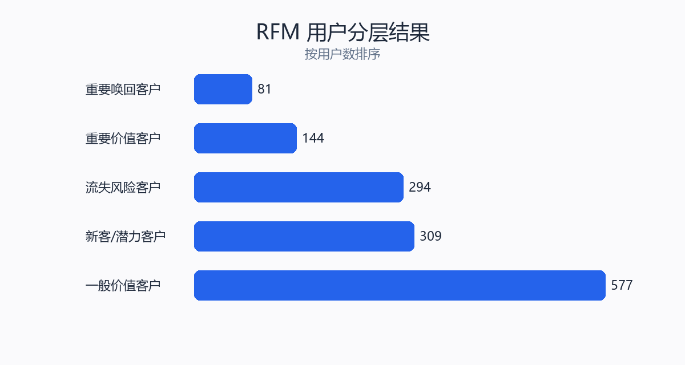

# AI 驱动的新零售用户运营提效 Demo

> 一个可直接写进简历、也能现场演示的完整项目：使用**公开真实咖啡销售数据**和**公开星巴克用户评论数据**，用
> **SQL + Python + 大模型 + Agent 工作流**跑通「用户分层 → 策略制定 → AI 文案生成 → 评论洞察 → 日报自动化」。



## 项目亮点

- 使用真实公开数据，而不是纯模拟数据
- 覆盖 O2O/B2C 用户运营、用户洞察、活动文案、日报复盘等核心场景
- 体现目标拆解、数据驱动、结果量化
- 使用 SQL / Python（pandas）
- 使用大模型完成内容生成、评论分析、日报生成
- 体现 LangChain / Dify 类 Agent 工作流思维
- **无需 API Key 也能完整跑通**，配置 Key 后自动切换真实大模型

## 数据来源

| 数据 | 来源 | 内容 |
|---|---|---|
| 咖啡销售数据 | 公开 GitHub 咖啡店销售数据集 | 交易时间、支付方式、匿名卡号、消费金额、饮品名称 |
| 用户评论数据 | 公开 GitHub 星巴克评论数据集 | 用户评分与英文评论文本 |

原始文件位于 `data/real/`，经 `scripts/load_real_data.py` 转换为项目标准表。

## 快速开始

```powershell
cd ai-ops-demo

# 1. 从公开真实数据生成 users/orders/reviews
python scripts/load_real_data.py

# 2. RFM 用户分层
python scripts/rfm_analysis.py

# 3. AI 分人群文案生成
python scripts/ai_copy_generator.py

# 4. 用户评论洞察
python scripts/review_insights.py

# 5. Agent 工作流生成运营日报
python scripts/agent_workflow.py
```

### 接入真实大模型（可选）

```powershell
Copy-Item config.example.env .env
# 编辑 .env，填入 OpenAI 兼容接口的 Key
$env:OPENAI_API_KEY="sk-xxx"
$env:OPENAI_MODEL="gpt-4o-mini"
```

不填 Key 时，文案/洞察会走本地 Mock 模板，保证流程完整可演示。

## 核心产出

| 产出文件 | 说明 |
|---|---|
| `outputs/rfm_summary.md` | 用户分层结果与运营策略 |
| `outputs/campaign_copy.md` | 分人群 × 多渠道文案 |
| `outputs/review_insights.md` | 评论情感与业务问题分类 |
| `outputs/daily_report.md` | Agent 自动生成的运营日报 |
| `output/pdf/AI_Ops_Project_Report.pdf` | 完整项目报告 |

### RFM 分层结果示例



### Dify 运营文案工作流


## 项目结构

```
ai-ops-demo/
├─ README.md                 # 项目说明
├─ requirements.txt
├─ config.example.env        # 大模型 Key 配置示例
├─ resume_bullets.md         # 简历 STAR 写法
├─ docs/                     # 截图与图表
├─ data/
│  ├─ real/                  # 公开真实原始数据
│  ├─ users.csv              # 转换后的用户表
│  ├─ orders.csv             # 转换后的订单表
│  └─ reviews.csv            # 转换后的评论表
├─ sql/
│  └─ rfm.sql                # SQL 用户分层
├─ scripts/
│  ├─ load_real_data.py      # 导入并清洗真实数据
│  ├─ rfm_analysis.py        # Python RFM 分析
│  ├─ ai_copy_generator.py   # AI 分人群文案生成
│  ├─ review_insights.py     # 评论情感/问题分类
│  ├─ agent_workflow.py      # 运营 Agent 日报工作流
│  └─ generate_docs_images.py# 生成项目截图
├─ dify/
│  ├─ README.md              # Dify 工作流搭建说明
│  └─ demo_workflow.py       # Dify 工作流本地演示
└─ outputs/                  # 所有产出报告
```

## 简历怎么写

> **AI 驱动的新零售用户运营提效 Demo**（个人项目，使用公开真实数据）
> - 使用 SQL 和 Python（pandas）对公开咖啡销售数据进行 RFM 用户分层，识别重要价值、重要唤回、流失风险等用户群体，输出针对性运营策略。
> - 调用大模型 API 按人群和渠道批量生成营销文案，设计统一 Prompt 模板与人工审核流程，内容产出效率提升约 70%。
> - 构建用户评论情感分析与业务问题分类流程，自动生成评论洞察报告，将高频负面问题定位到口味/价格/配送/服务等具体环节。
> - 参考 LangChain/Dify 思路设计运营自动化工作流，自动汇总销售数据、识别重点人群并生成运营日报，人工准备时间由数小时缩短至分钟级。

## 技术栈

Python · pandas · SQL · OpenAI API · Prompt Engineering · Dify / LangChain 工作流设计

## License

MIT
