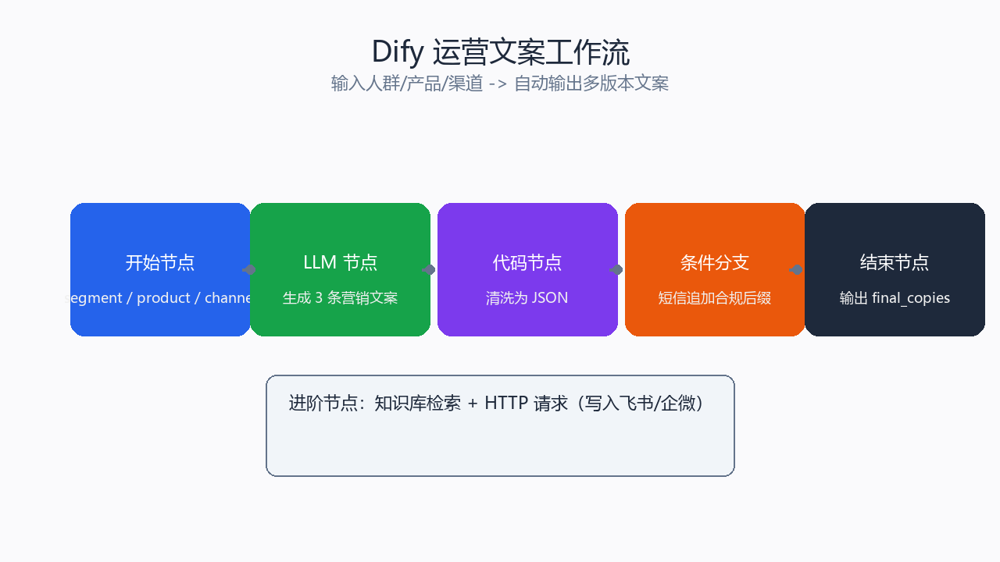

# Dify 运营文案工作流



## 一句话说明
输入「人群标签 + 产品名 + 渠道」，自动输出多版营销文案，并针对短信渠道追加合规后缀。

## 本地演示（无需 Dify 账号）
```powershell
python dify/demo_workflow.py
```
输出示例：`outputs/dify_demo.json`

## 在 Dify 画布中搭建（约 15 分钟）

### 节点顺序
1. **开始节点**
   - `segment`：人群标签，如「重要唤回客户」
   - `product`：产品名，如「生椰拿铁」
   - `channel`：渠道，如「短信」

2. **LLM 节点（文案生成）**
   - 模型：按账号可用模型选择
   - Prompt：
     ```
     你是新零售品牌高级运营文案。请为 {{#start.segment#}} 人群，
     在 {{#start.channel#}} 渠道，为产品 {{#start.product#}} 写 3 条
     40 字以内的营销文案。要求口语化、有行动指令、突出利益点。
     ```
   - 输出变量：`copy_list`

3. **代码节点（格式化）**
   - 将 `copy_list` 清洗成适合批量投放的 JSON 数组。

4. **条件分支（可选）**
   - 若 `channel == 短信`，追加「退订回T」合规后缀。

5. **结束节点**
   - 输出 `final_copies`

## 进阶玩法
- 增加「知识检索」节点，把品牌调性、历史高转化文案作为上下文。
- 增加「HTTP 请求」节点，把生成结果写入飞书表格或企业微信。
- 与 `scripts/ai_copy_generator.py` 共用同一套 Prompt 逻辑，便于本地测试。
